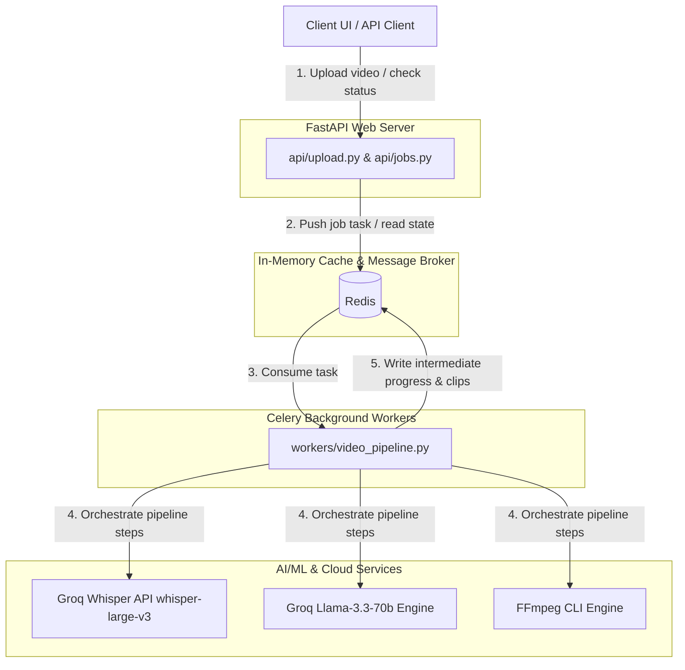
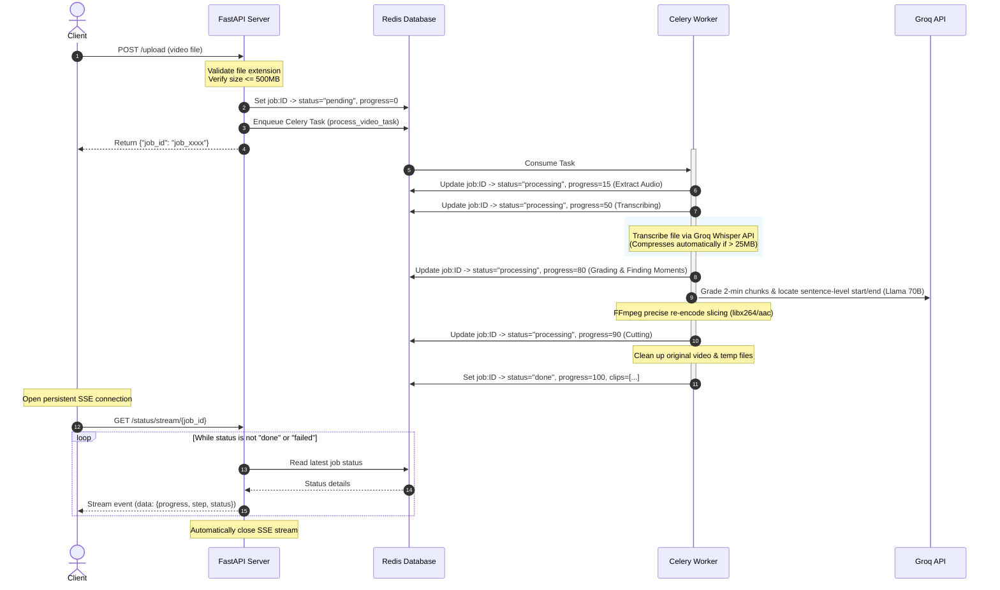

# System Architecture & Technical Design

This document describes the technical architecture, component design, data flow, and queueing patterns of **Framey** — an AI-powered Video-to-Shorts clipping pipeline.

---

## 🏛️ System Overview

Framey is built on a distributed, asynchronous microservice architecture designed to handle computationally heavy video processing tasks without blocking the user-facing web server.

---

## 📦 Docker Container Topology

The application is fully containerized and orchestrated using `docker-compose`. The stack consists of three services:

| Service Name | Base Image | Purpose | Port / Volumes |
| :--- | :--- | :--- | :--- |
| **`redis`** | `redis:alpine` | Acts as the Celery message broker and holds task status metadata. | Port `6379` |
| **`backend`** | `python:3.12-slim` | Runs the FastAPI web application (Uvicorn). Exposes upload & tracking endpoints. | Port `8000` Volume `/app/temp` |
| **`worker`** | `python:3.12-slim` | Runs the Celery daemon executing background video-to-shorts pipeline tasks. | Volume `/app/temp` |

> [!NOTE]
> A shared Docker volume named `temp_data` is mounted to `/app/temp` on both `backend` and `worker` containers. This allows the backend to save the uploaded video file, and the worker to access and slice it without needing file transfers.

---

## 🔄 End-to-End Execution Flow

When a video is uploaded, it triggers an asynchronous processing lifecycle:

---

## 🛠️ Deep Dive: The 5 Pipeline Stages

### Stage 1: Audio Extraction (`services/audio_extractor.py`)
*   **Command**: Runs FFmpeg to separate the audio track:
    `ffmpeg -y -i input.mp4 -q:a 0 -map a output.mp3`
*   **Output**: High-fidelity `.mp3` file inside `backend/temp/`.

### Stage 2: Cloud Transcription (`services/transcriber.py`)
*   **Action**: Transcribes the entire master audio file using the **Groq Whisper API** (`whisper-large-v3`).
*   **Auto-Compression**: To fit within Groq's 25MB file upload limit, files larger than 25MB are dynamically compressed to a 32kbps mono MP3 using FFmpeg before sending the API request.
*   **Parameter**: Requests `timestamp_granularities=["word"]` to retrieve precise timing for every spoken word, allowing accurate sentence and phrase boundaries.

### Stage 3: Chunk Grading (`services/chunk_grader.py`)
*   **Action**: Groups words into 2-minute blocks and scores them via **Groq** (`llama-3.3-70b-versatile`).
*   **Resiliency**: Uses parallel request pacing (`max_workers=2`) and a retry loop with exponential backoff (starting at `2.0s` sleep) to avoid API rate limits (`429`).
*   **Logic**: Surviving blocks must score $\ge 6$ on viral potential, hooks, and completeness.

### Stage 4: Moment Finding (`services/moment_finder.py`)
*   **Action**: Passes high-scoring transcript blocks and word lists to Groq to extract the exact boundaries of the best 30–90 second clip.
*   **Optimization**: Formats the word timestamp listing in a highly compact string layout (`word(start,end)`) rounded to 1 decimal place. This reduces the prompt payload by **over 10x**, staying well under Groq's strict token limits (preventing `413 Payload Too Large` issues).
*   **Logic**: Enforces that boundaries align with natural sentence boundaries (never cut mid-word or mid-sentence).

### Stage 5: Precise Slicing & Storage Sweep (`services/clip_cutter.py`)
*   **Command**: Runs FFmpeg to cut the clips:
    `ffmpeg -y -ss START -i input.mp4 -t DURATION -c:v libx264 -c:a aac output.mp4`
*   **Precision**: Re-encodes using H.264/AAC. This guarantees the video starts precisely on a keyframe at the target timestamp, eliminating black or frozen screen glitches.
*   **Sweep**: Automatically deletes intermediate audio and the original uploaded source video on successful or failed pipeline runs.

---

## 🔒 Security & Limit Verification

*   **Size Restriction**: FastAPI `/upload` limits files to **500MB**. It reads input streams in 1MB chunks and raises `413 Payload Too Large` immediately if exceeded, removing the partial file.
*   **Extension Validation**: Checks file extensions against a strict allowlist: `.mp4`, `.mov`, `.mkv`, `.avi`, and `.webm`.
