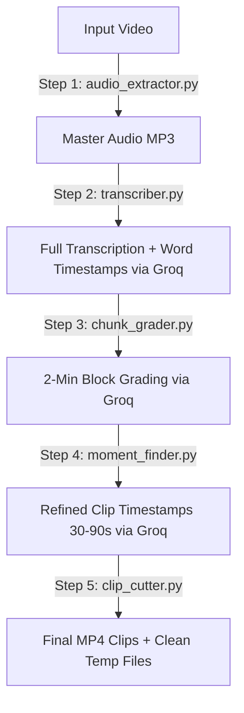

# Framey: AI-Powered Video-to-Shorts Pipeline

Framey is an enterprise-ready, AI-powered video editing pipeline designed to turn raw, long-form video footage into viral-ready, standalone short clips (such as TikToks, YouTube Shorts, or Instagram Reels) — automatically graded, cut, and timed in minutes.

---

## 🏛️ System Architecture

Framey operates on a distributed, asynchronous queue system utilizing **FastAPI**, **Celery**, and **Redis**. High-intensity workloads (like transcription and video rendering) run in the background, keeping the user interface completely non-blocking and responsive.

Detailed documentation on structural topology, database keys, and queue patterns can be found in the [ARCHITECTURE.md](ARCHITECTURE.md) document.



---

## ✨ Features & Optimizations

*   **⚡ Near-Instantaneous Speed**: Transcription is powered by the **Groq Whisper API (`whisper-large-v3`)**, completing a full 1-hour transcription in just **14 seconds** (an 80x speedup compared to local models).
*   **💾 Tiny Resource Footprint**: With local transcription models removed, memory usage drops by 80%, enabling deployment on any $0 free tier host.
*   **⚖️ Automatic Compression**: Audio files larger than 25MB are dynamically compressed to 32kbps mono MP3 before uploading, fitting seamlessly within Groq's API limitations.
*   **Precise Slicing (Glitch-Free)**: Re-encodes output video streams (`-c:v libx264 -c:a aac`) to guarantee clips cut exactly on sentence/word boundaries. No black frames, frozen screens, or sound desynchronization.
*   **Upload Guards**: Validates incoming file formats (`.mp4`, `.mov`, `.mkv`, `.avi`, `.webm`) and caps file sizes at `500MB` via chunked stream monitoring.
*   **Automated Storage Reclamation**: Sweeps away all intermediate files (raw audio, temporary compressed audio) and deletes the original uploaded file upon job completion or failure, maintaining a minimal storage footprint.
*   **Groq API Rate-Limit Protection**: Wraps grader and moment extraction in retry loops with exponential backoff and paces concurrent requests (`max_workers=2`) to handle HTTP `429` (Rate-Limit Exceeded) responses gracefully.

---

## 📁 Directory Structure

```text
Framey/
├── ARCHITECTURE.md             # Full system architecture guide
├── backend/
│   ├── run_pipeline.py         # End-to-end orchestration runner for tests
│   ├── main.py                 # FastAPI web application entry point
│   ├── api/
│   │   ├── upload.py           # POST /upload with size limits and format checks
│   │   └── jobs.py             # GET /status/{job_id} endpoint
│   ├── services/
│   │   ├── audio_extractor.py  # Step 1: Extracts audio track via FFmpeg
│   │   ├── transcriber.py      # Step 2: Groq Whisper API transcription with compression
│   │   ├── chunk_grader.py     # Step 3: Groq evaluation with backoff
│   │   ├── moment_finder.py    # Step 4: Groq sentence alignment with backoff
│   │   └── clip_cutter.py      # Step 5: Re-encodes H.264 clips & cleans up temp directories
│   ├── workers/
│   │   ├── celery_app.py       # Celery configuration
│   │   └── video_pipeline.py   # Main pipeline orchestrator/Celery task
│   └── temp/                   # Auto-generated workspace for cuts
├── frontend/                   # Client workspace placeholder
├── docker-compose.yml          # Container configuration (FastAPI, Redis, Celery Worker)
├── .env                        # Environment configurations (Groq API keys)
└── README.md                   # Core Documentation
```

---

## 🛠️ Setup & Installation

### Option 1: Docker Compose (Recommended)
Make sure you have [Docker](https://www.docker.com/) and Docker Compose installed.

1. Create a `.env` file in the root directory:
   ```env
   GROQ_API_KEY=your_groq_api_key_here
   ```
2. Build and start the services:
   ```bash
   docker-compose up --build
   ```

This launches:
*   **Redis** on port `6379`
*   **FastAPI backend** on port `8000`
*   **Celery worker** (listens to tasks)

### Option 2: Local Installation (Manual)
1.  **Install FFmpeg**:
    ```bash
    # Ubuntu / Debian
    sudo apt update && sudo apt install -y ffmpeg
    # macOS
    brew install ffmpeg
    ```
2.  **Setup Virtual Environment**:
    ```bash
    cd backend
    python3 -m venv venv
    source venv/bin/activate
    pip install -r requirements.txt
    ```
3.  **Run Locally**:
    *   Start Redis locally or through Docker: `docker run -d -p 6379:6379 redis:alpine`
    *   Start FastAPI server: `python3 main.py`
    *   Start Celery worker: `celery -A workers.celery_app worker --loglevel=info`

---

## 💻 API Endpoints

### 1. Upload Video
*   **Endpoint**: `POST /upload`
*   **Content-Type**: `multipart/form-data`
*   **Body**: `file` (Video binary)
*   **Response**:
    ```json
    {
      "job_id": "job_e9b441ca"
    }
    ```

### 2. Get Job Status (Polling)
*   **Endpoint**: `GET /status/{job_id}`
*   **Response (Processing)**:
    ```json
    {
      "status": "processing",
      "step": "Transcribing...",
      "progress": 50,
      "clips": []
    }
    ```
*   **Response (Done)**:
    ```json
    {
      "status": "done",
      "step": "Complete",
      "progress": 100,
      "clips": [
        {
          "path": "temp/job_e9b441ca/clip_1.mp4",
          "start": 12.34,
          "end": 67.89,
          "duration": 55.55,
          "reason": "A highly punchy hook summarizing the core tip."
        }
      ]
    }
    ```

### 3. Get Job Status (Real-time Stream)
*   **Endpoint**: `GET /status/stream/{job_id}`
*   **Protocol**: HTTP Server-Sent Events (SSE)
*   **Data Format**: `text/event-stream` (Yields status data prefixed with `data: ` whenever it updates, closing the stream automatically when the job finishes).

---

## 💡 Key Design Highlights

> [!TIP]
> **Optimized Token Payload:** By compressing LLM word lists to single-decimal formats (`hello(0.0,0.5)`), the prompt size is cut by 10x, protecting the application from hitting Groq's request size and token rate limits.
> **Cost & Speed Optimized:** Video cutting uses H.264 and AAC re-encoding which ensures that cut clips play back smoothly and without glitches on modern platforms.