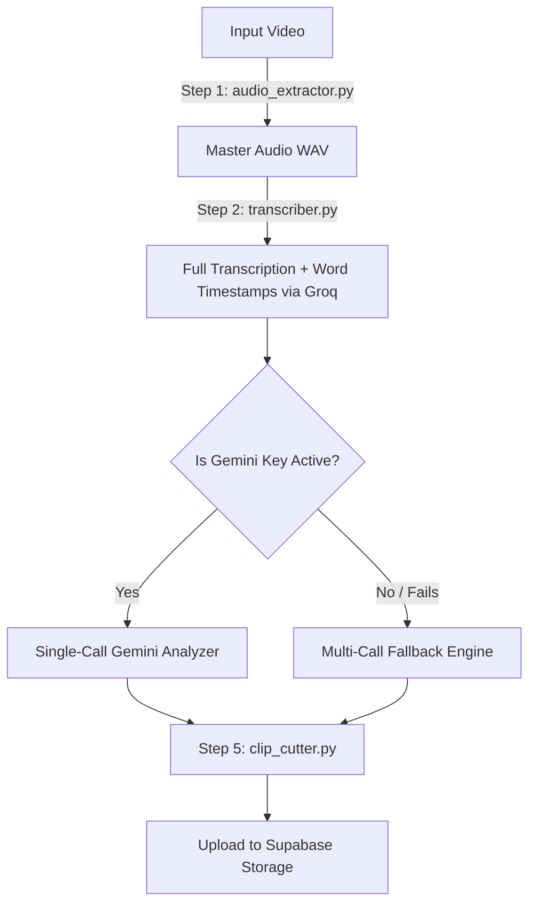

# Framey: AI-Powered Video-to-Shorts Pipeline

Framey is a production-grade, AI-powered video editing pipeline designed to turn raw, long-form video footage into viral-ready, standalone short clips (such as TikToks, YouTube Shorts, or Instagram Reels) — automatically graded, cut, and timed in minutes.

---

## 🏛️ System Architecture

Framey operates on a distributed, asynchronous queue system utilizing **FastAPI**, **Celery**, and **Redis**. High-intensity workloads (like transcription and video rendering) run in the background, keeping the user interface completely non-blocking and responsive.

Detailed documentation on structural topology, database keys, and queue patterns can be found in the [ARCHITECTURE.md](ARCHITECTURE.md) document.



---

## ✨ Features & Optimizations

*   **⚡ Single-Call Gemini Analyzer (Primary)**: If a `GEMINI_API_KEY` is present, Framey formats the entire transcript and resolves all clips in **exactly 1 API call**. This runs in seconds and completely bypasses rate-limiting conditions.
*   **⚖️ Dual-Engine Fallback (Secondary)**: If the Gemini key is missing or encounters a quota block, the pipeline automatically falls back to Groq/Heuristic Mode, performing block-by-block evaluations.
*   **🎙️ Cloud Transcription**: Powered by the **Groq Whisper API (`whisper-large-v3-turbo`)**, completing a full 1-hour transcription in just **14 seconds**.
*   **Precise Slicing (Glitch-Free)**: Re-encodes output video streams (`-c:v libx264 -c:a aac`) to guarantee clips cut exactly on sentence/word boundaries. No black frames, frozen screens, or sound desynchronization.
*   **Upload Guards**: Validates incoming file formats (`.mp4`, `.mov`, `.mkv`, `.avi`, `.webm`) and caps file sizes at `500MB` via chunked stream monitoring.
*   **Direct Browser Downloads**: Downloads clips directly to your device as `.mp4` files via standard browser download prompts (backed by JavaScript blob converters) instead of playing them in new browser tabs.
*   **Supabase Storage Integration**: Automatically uploads completed clips to a public Supabase storage bucket, securing the clips while saving local disk space.

---

## 📁 Directory Structure

```text
Framey/
├── ARCHITECTURE.md             # Full system architecture guide
├── DEPLOYMENT.md               # Cloud deployment guide
├── docker-compose.yml          # Container configuration (React, FastAPI, Redis, Worker)
├── backend/
│   ├── main.py                 # FastAPI web application entry point
│   ├── api/
│   │   ├── upload.py           # POST /upload with size limits and format checks
│   │   └── jobs.py             # GET /status/{job_id} endpoint
│   ├── services/
│   │   ├── audio_extractor.py  # Step 1: Extracts audio track via FFmpeg
│   │   ├── transcriber.py      # Step 2: Groq Whisper API transcription with compression
│   │   ├── chunk_grader.py     # Step 3: Groq evaluation fallback with backoff
│   │   ├── moment_finder.py    # Step 4: Single-call analyzer & moment selection
│   │   ├── clip_cutter.py      # Step 5: Re-encodes H.264 clips & cleans up temp directories
│   │   └── supabase_client.py  # Supabase client helper
│   ├── workers/
│   │   ├── celery_app.py       # Celery configuration
│   │   └── video_pipeline.py   # Main pipeline orchestrator/Celery task
│   └── temp/                   # Auto-generated workspace for cuts
├── frontend/
│   ├── src/                    # React frontend source files
│   │   ├── App.jsx             # Main dashboard logic and SSE streams
│   │   └── App.css             # Glassmorphic UI styles and download spinners
│   ├── index.html              # HTML shell entry point
│   └── Dockerfile              # Container building Vite server
└── README.md                   # Core Documentation
```

---

## 🛠️ Setup & Installation

### Option 1: Docker Compose (Recommended)
Make sure you have [Docker](https://www.docker.com/) and Docker Compose installed.

1. Create a `.env` file in the root directory:
   ```env
   GROQ_API_KEY=your_groq_api_key_here
   GEMINI_API_KEY=your_gemini_api_key_here
   VITE_SUPABASE_URL=your_supabase_url_here
   VITE_SUPABASE_ANON_KEY=your_supabase_anon_key_here
   SUPABASE_SERVICE_ROLE_KEY=your_supabase_service_role_key_here
   ```
2. Build and start the services:
   ```bash
   docker-compose up --build
   ```

This launches:
*   **React frontend** on port `3000`
*   **FastAPI backend** on port `8000`
*   **Redis** on port `6379`
*   **Celery worker** (listens to tasks)

---

## 💻 API Endpoints

### 1. Upload Video
*   **Endpoint**: `POST /upload`
*   **Content-Type**: `multipart/form-data`
*   **Body**: `file` (Video binary)
*   **Response**:
    ```json
    {
      "job_id": "job_e9b441ca"
    }
    ```

### 2. Get Job Status (Polling)
*   **Endpoint**: `GET /status/{job_id}`
*   **Response (Done)**:
    ```json
    {
      "status": "done",
      "step": "Complete",
      "progress": 100,
      "clips": [
        {
          "path": "https://yourproject.supabase.co/storage/v1/object/public/clips/job_e9b441ca/clip_1.mp4",
          "start": 12.34,
          "end": 67.89,
          "duration": 55.55,
          "reason": "A highly punchy hook summarizing the core tip."
        }
      ]
    }
    ```