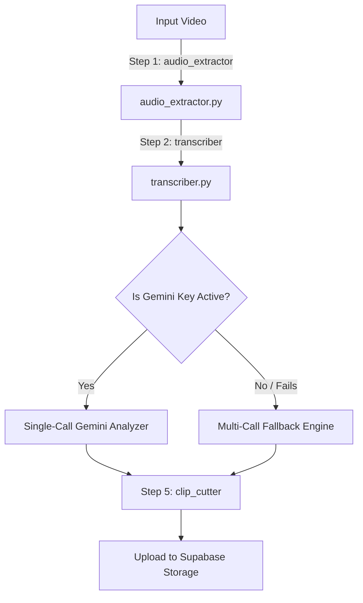

# Video-to-Shorts Pipeline Backend

This directory contains the backend services, FastAPI endpoints, and Celery task orchestration logic for the AI-powered video-to-shorts conversion pipeline. The pipeline takes a raw video file, processes it, scores the narrative structure using LLMs, and extracts standalone short clips.

---

## ⚙️ How It Works (The Core Pipeline)

The video processing task runs asynchronously using Celery:



### Stage Details

1. **Audio Extraction (`services/audio_extractor.py`)**
   * Uses `ffmpeg` to extract the master audio channel from the source video as a `.wav` file.
   
2. **Cloud Transcription (`services/transcriber.py`)**
   * Transcribes the master audio file using the **Groq Whisper API** (`whisper-large-v3-turbo`). 
   * Audio files larger than 25MB are compressed to mono MP3s before upload to meet API constraints.

3. **Viral Moment Spotting (`services/moment_finder.py`)**
   * **Single-Call Gemini Analyzer (Primary)**: Structures the transcript with timestamp markings and submits the entire video context to `gemini-2.5-flash` in a single prompt. This returns all selected moments instantly without triggering rate limits.
   * **Multi-Call Fallback Engine (Secondary)**: If Gemini is unavailable, falls back to `chunk_grader.py` (which scores 2-minute blocks) and `find_moment_in_block` sequentially.

4. **Clip Slicing & Encoding (`services/clip_cutter.py`)**
   * Slices the source video at exact boundaries using H.264/AAC re-encoding (`-c:v libx264 -c:a aac`) to guarantee glitch-free, frame-perfect starting and ending boundaries.
   * Cleans up all intermediate audio and temporary files upon completion or failure.

5. **Cloud Upload (`services/supabase_client.py`)**
   * Automatically uploads the sliced `.mp4` video clips to a public Supabase Storage bucket (`clips`).

---

## 🛠️ Requirements & Setup

### 1. System Dependencies
* **System**: `ffmpeg` (for media processing)
* **Python**: `python >= 3.10`

### 2. Manual Environment Configuration
Ensure a `.env` file exists at the root of the workspace containing:
```env
GROQ_API_KEY=your_groq_api_key
GEMINI_API_KEY=your_gemini_api_key
VITE_SUPABASE_URL=your_supabase_url
VITE_SUPABASE_ANON_KEY=your_supabase_anon_key
SUPABASE_SERVICE_ROLE_KEY=your_supabase_service_role_key
```

### 3. Running Locally (Manual)
1. **Start Redis**:
   ```bash
   docker run -d -p 6379:6379 redis:alpine
   ```
2. **Start FastAPI application**:
   ```bash
   uvicorn main:app --host 0.0.0.0 --port 8000 --reload
   ```
3. **Start Celery worker**:
   ```bash
   celery -A workers.celery_app worker --loglevel=info
   ```
