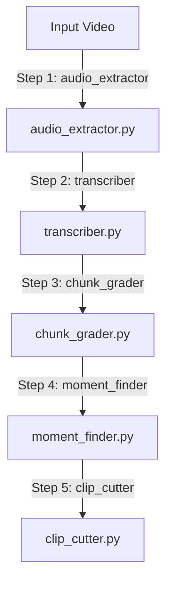

# Video-to-Shorts Pipeline Backend

This directory contains the backend services and orchestration logic for the AI-powered video-to-shorts conversion feature. The pipeline takes a raw video file, processes it, scores the narrative structure using LLMs, and extracts standalone short clips.

---

## ⚙️ How It Works (The 5-Step Pipeline)

The core feature is executed sequentially across 5 stages:



### Stage Details

1. **Audio Extraction (`services/audio_extractor.py`)**
   * Uses `ffmpeg` to extract the master audio channel from the source video as an MP3.
   
2. **Cloud Transcription (`services/transcriber.py`)**
   * Transcribes the entire master audio file using the **Groq Whisper API** (`whisper-large-v3`). 
   * Files larger than 25MB are dynamically compressed to a 32kbps mono MP3 using FFmpeg before uploading to remain within the Groq API file size limits.

3. **Transcript Grading (`services/chunk_grader.py`)**
   * Segments the transcript into 2-minute blocks and prompts the Groq API (`llama-3.3-70b-versatile`) to evaluate them. Blocks scoring $\ge 6$ on a scale of 1-10 (relevance, punchiness, hook presence) are selected for clip generation.
   * Utilizes sequential request pacing (`max_workers=2`) and backoff retry loops to prevent hitting rate limits (`429`).

4. **Moment Finder (`services/moment_finder.py`)**
   * Identifies the exact starting and ending word-level timestamps (between 30 and 90 seconds) for the most standalone segment within each high-scoring block. 
   * Formats the word timestamps list using a highly compact structure (`word(start,end)`) rounded to 1 decimal place, reducing token payload by **over 10x** to avoid request payload limits.

5. **Clip Cutter & Cleanup (`services/clip_cutter.py`)**
   * Cuts the video at exact boundaries using H.264/AAC re-encoding (`-c:v libx264 -c:a aac`) to guarantee glitch-free, frame-perfect starting and ending boundaries.
   * Cleans up all intermediate audio and the original raw uploaded video from the temp directory once completed or failed.

---

## 🛠️ Getting Started

### 1. Requirements
* **System**: `ffmpeg`
* **Python**: `python >= 3.10`

### 2. Install Dependencies
Ensure you are in the `backend/` directory, activate your virtual environment, and run:
```bash
pip install groq python-dotenv uvicorn fastapi celery redis
```

### 3. Environment Variables
Ensure a `.env` file exists at the root of the workspace containing:
```env
GROQ_API_KEY=your_groq_api_key
```

---

## 💻 Running the Pipeline

### End-to-End Orchestrator
To execute the complete 5-step pipeline:
```bash
python3 run_pipeline.py
```
This imports `process_video` from `workers/video_pipeline.py` and logs the pipeline's progress in real-time, outputting final video files in `temp/<job_id>`.
